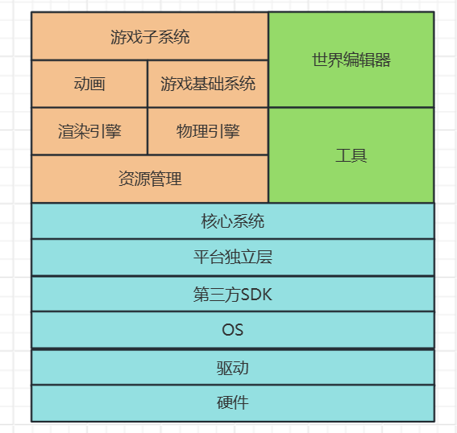

#	游戏引擎简介

##常见的游戏引擎：

- Unreal Engine
  - 渲染品质：电影级别**PBR**渲染，先进的着色模型
  - 美术制作：成熟的美术资产制作管线
  - C++与蓝图：性能与可视化编程并重
  - 开发周期：基于射击类的**GamePlay**框架
  - 跨平台
  - 开源
- Unity：手游主导引擎，闭源
- CryEngine
- Source2
- FrostBite Engine：EA内部引擎
- AnvilNext：育碧内部引擎
- IW Engine：动视内部引擎


## 游戏引擎概念：

- 定义：专门为游戏而设计的工具及科技集合
- 特点：
  1. 游戏行为全部或部分由美术或者策划提供的数据控制
  2. 通用性与偏向性
  3. 可扩展性
  4. 完整工具链
- 引擎架构：
   


## 游戏引擎：渲染：

###Deferred Renderer

- 编辑器、PC、Console默认渲染管线
- Feature levels “SM4”，“SM5”

###Forward+ Renderer

- 用于桌面VR游戏，支持MSAA
- Feature level “SM5”

###Mobile Renderer

- Forward Render，Deferred Render
- Feature levels “ES2”，“ES3”，“Vulkan”


##游戏引擎：物理系统：

###Havok

- Physics、Destruction、Cloth、AI、Behavior、Animation、FX
- 被Intel、微软收购，对CPU友好

###PhysX：

- 集成于UE4和Unity
- 被NVIDIA收购，对GPU友好

###Bullet：

- 最早开源，用于GTA5、荒野大镖客
- 

#Unreal Engine 介绍

##UE发展过程

| 年份 | UE版本 | 代表作                | 特点                   |
| ---- | :----: | :-------------------- | ---------------------- |
| 1998 |  UE1   | 《Unreal》            | 首款、支持mod          |
| 2003 |  UE2   | 《Unreal Tournament》 | 粒子系统、物理引擎     |
| 2006 |  UE3   | 《Gears of War》      | 可视化脚本、新物理引擎 |
| 2014 |  UE4   | 《Gears of War 4》    | 蓝图脚本、开放世界     |
| 2021 |  UE5   | 《Fortnite》          | 像素级渲染、全局光照   |

## UE学习资料

- YouTube
- 知乎
- B站

##Editor使用：

1. 技巧：
   - 相机移动：
     - 调整相机角度（Q、E+鼠标右键）
     - 将相机聚焦在所选物体上（选择物体后F键）
     - 调整相机的移动速度（Camera Speed面板）
     - 保存常用的相机位置和朝向（Ctrl + 数字键）
   - 过滤显示的物体（Show面板中将不需要显示的物体类型取消勾选）
   - World Outliner搜索
     - 关键字搜索
     - ‘+’ 完全匹配
     - ‘-’ 排除
   - 世界空间区域框选：
     - 顶视图直接框选
     - 透视视图 Ctrl + Alt 再框选
   - 游戏物体贴地快捷键
     - `End`：中心贴地
     - `Alt+End`：轴心贴地
     - `Shift+End`：碰撞盒贴地
2. Derived Data Cache：用于对导入的素材进行处理以适应UE开发以及多平台打包使用
3. [Content Browser 命名规范](https://github.com/Allar/ue5-style-guide)
4. Project Struct

#UE编程技巧

## 游戏框架

- `GameMode` 游戏模式类：负责设置正在执行的游戏规则（包含玩家如何加入游戏、是否可以暂停游戏、关卡过度，以及特定的游戏行为）
- `GameState` 游戏状态类：包含要复制到游戏中的每个客户端的信息，它表示**整个游戏**的“游戏状态”（包含有关游戏分数、比赛是否已经开始和基于世界场景玩家人数要生成的AI数量的信息等等）
- `PlayerState` 玩家状态类：游戏玩家的状态、非玩家AI不会拥有玩家状态（包括玩家姓名或得分、当前等级或生命值等）
- `Pawn` 兵卒：是`Actor`的一个子类，充当游戏中的生命体（类似于Unity中的`GameObject`）
- `PlayerController` 玩家控制器：将玩家的输入转换为交互，通常拥有一个`Pawn`作为游戏中玩家的代表

## Blueprint 和 Lua

###Blueprint：

1. 概念：一个基于节点界面的完整的游戏玩法编辑系统（[官方文档中的解释](https://docs.unrealengine.com/zh-CN/Engine/Blueprints/index.html)）

2. 分类：

- Level Blueprint，

     - 自动创建，每个 Level 一个
     - 生命周期是整个关卡存在的时间
     - 监听 Level 级的事件

   - Blueprint Class
        - 需要继承已有的类
        - 可以添加不同的组件来丰富功能
        - 通常被放置在关卡中，执行自身的逻辑功能

- Data-Only Blueprint

- Blueprint Interface

- Blueprint Macros

- Blueprint 的使用

     - 从监听的事件开始调用
     - 从其他`Actor`的接口中进行调用
     - 通过调用蓝图库中的函数来调用

- 使用原则：

     - 用于数值配置
     - 用于简单的效果展示
     - 用于特别简单的逻辑（代码不超过屏幕范围）

     

###Lua

- 目前最主流的游戏脚本语言
- **可以通过 UE 的反射能力再配合插件的使用，将蓝图接口和静态 C++ 接口导出到 Lua 中，支持 Lua 和 C++ 双向，Lua 和 blueprint 的双向调用**

## C++ In UE

- C++ 类向导：UE 中的 C++ 类是通过 UE 的类向导进行创建，可以预先做好一些继承、适配 UE 使用的操作

- 编码规范：详见`03 UE5的C++代码规范`

- 基本类型：

  - 不使用C++原生的类型（`int`、`char`、`long`，etc.），而使用 UE 引擎中封装的类型
  - `UObject`：为标准 C++ 增加了很多功能
    - 类的成员变量和函数的运行时反射
    - 序列化从磁盘或网络中读出的文件或将序列化文件写到磁盘或网络中
  - `Magic Macros`：定义了很多宏用于类型的识别，便于序列化为配置表

- 局部关闭优化：在调试时可以只对一部分代码进行调试

  - Visual Studio配置运行模式
    - 调试（Debug）：包含用于调试的符号。会同时构建引擎和游戏代码
    - 调试游戏（DebugGame）：按最优方式构建引擎，但游戏代码为可调试状态。适用于调试游戏模块
    - 开发（Development）：启用所有功能，但不会进行最耗费时间的引擎和代码优化。从开发和性能角度看，这是最佳的配置
    - 交付（Shipping）：最佳性能配置，用于交付游戏。此配置剥离了控制台命令、统计数据和性能分析工具。
  - 对单个函数关闭优化：在函数开头

  ```c++
  //在函数开头：
  #ifdef __clang__
  #pragma clang optimize off
  #else
  #pragma optimize("", off)
  #endif
  //再在函数结尾：
  #ifdef __clang__
  #pragma clang optimize on
  #else
  #pragma optimize("", on)
  #endif
  ```

# 引擎工具

1. 日志 Log
2. 可视化日志 Visual Log [官方文档](https://www.unrealengine.com/zh-CN/blog/using-the-ue4-visual-logger)
3. 内置控制台
   1. 在游戏运行时按`~`键打开控制台，在移动平台时四指划屏
   2. 常用命令
      - Stat FPS 显示帧数
      - Stat UNIT 对游戏线程、渲染线程、GPU耗时进行统计，分析瓶颈
      - Stat GAME 对游戏各个模块的tick耗时进行统计
      - Stat SceneRendering 渲染基本信息统计，可以查看DrawCall数
      - Stat Engine 渲染信息统计，可以查看三角形数量
      - Stat InitViews 可以查看视口剔除的三角形数量
4. GPU工具
   1. GPU Profile：`Ctrl + Shift + ,`在编辑器状态下截取GPU快照，并可视化显示
   2. RenderDoc
5. Unreal Insight