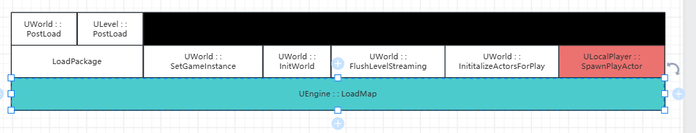
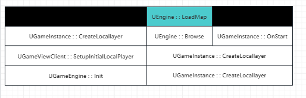
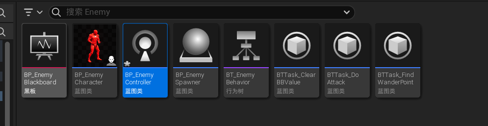

# 什么是好游戏？

1. 精品游戏 = 仿真（模拟现实的布局） + 抽象（脱离现实的布局）
2. 什么是游戏模式
   1. 概念：游戏世界里组织数据和运作规则的方式
   2. 需要考虑的问题：
      - 游戏物体有什么共同点、不同点？如何抽象？
      - 游戏里的万物以什么规则运行？
      - 数据如何组织、描述？


# UE游戏模式框架

## 万物之源`UObject`：

- 用于元数据、反射生成、GC垃圾回收、序列化
- 包含一些通用的属性和接口（Equals、Clone、Get Hash Code、ToString、Get Name、GetMetaData等）


## 物体的表达`Actor + ActorComponent`：

- EC架构（Entity-Component Framework）：一个实体和多种能力组合的设计模式
- `SceneComponent`通过其中的变量`FTransform`赋予`Actor`空间变化信息


## 世界的表达`UWorld + ULevel`：

- 平行世界：GameWorld、PIE（Play In Editor）World、PreviewWorld……
- 关卡构成：主关卡PersistentLevel + 子关卡
- 关卡加载：LevelStreaming流式异步加载
  - World Partition（UE5）
    - 分成了许多layer（像是切割了许多水平面，位于不同的水平面上就会加载不同的范围）
    - 每个layer会设置不同的加载范围，在范围内的就会加载
  - World Composition
  - Load By Logic
- 关卡大小和加载距离
  - LevelBounds + StreamingDistance分层
  - 取覆盖范围最大的的盒子的加载距离
- 关卡蓝图LevelScriptActor：定义关卡规则


## 世界之上`UGameInstance + UEngine`：

- `UGameInstance`：信息存在于整个游戏的生命周期，不随着地图的切换和销毁。非常适合非业务逻辑的全局管理操作，如全局UI、设置、预加载
- `UEngine`：管理`GameInstance`、拉起游戏的重要流程
- UE游戏世界拉起流程（其中横向为游戏运行时间，纵向为调用堆栈）：






# UE游戏模式中的重要对象

## `AActor`：游戏中最重要的实体

- 根据组件提供世界变化信息
- 作为网络同步的基础单位
  - 详见`09 UE网络同步` 
- 标志所有权的`Owner`指针
- 标志本地权限的`Role`枚举
- 生命周期（一）
  - 关卡内摆放的静态`Actor`
  - `SpawnActor`创建的动态`Actor`
- 生命周期（二）：重要的生命周期函数
  - BeginPlay（Awake）
  - EndPlay（OnDestroy）
  - Tick（Update）
- 生命周期（三）：
  - GC完成收尾工作
  - 注意有效性判断


## `APawn`：可操控的棋子

- 多种多样的形式

- 可以被Controller控制

- 基础的输入、移动框架支持

- `APawn`常用派生类

  1. `ADefaultPawn`

     - 简单球型碰撞 `USphereComponent`
     - 简单外显 `UStaticMeshComponent`
     - 简单移动组件 `UFloatingPawnMovement`
     - 基础的键盘、手柄映射

  2. `ASpectatorPawn`

     - 去掉外显 `UStaticMeshComponent`
     - 移动组件替换成忽略时间缩放的 `USpectatorPawnMovement`

  3. `ACharacter`人形角色

     - 近似仿真人形的胶囊体碰撞盒`UCapsuleComponent`，在保证一定真实性的同时，节约性能
     - 骨骼模型`USkeletalMeshComponent`，动画蓝图赋予人物生动表现
     - 人物移动组件`UCharacterMovementComponent`
       - 配合胶囊体完成Walking、Falling、Swimming、Flying等多种仿真移动计算
       - 提供Custom自定义移动模式提供扩展
       - 网络游戏移动同步框架
         1. 主控端预表现
         2. 服务器端校验
         3. 模拟端预测

  4. `AController`和`APawn`的双向奔赴

     - `Possess`与`PossessedBy`，为`Pawn`设置`Owner`

       - 为指针`Controller`、`PlayerState`赋值
       - 改变网络游戏中的`Role`

       ```c+
       void APawn::PossessedBy(AController* NewController) {
       	SetOwner(NewController);
       	AController* const OldController = Controller;
       	Controller = NewController;
       	ForceNetUpdate();
       	#if WITH_IRIS
       	// IRIS 处理器块
       	#endif
       	if (Controller->PlayerState != nullptr) {
       		SetPlayerState(Controller->PlayerState);
       	}
       	
       	if (APlayerController* PlayerController = Cast<APlayerController>(Controller)) {
       		if (GetNetMode() != NM_Standalone) {
       			SetReplicates(true);
       			SetAutonomousProxy(true);
       		}
       		else {
       			CopyRemoteRoleFrom(GetDefault<APawn>());
       		}
       	}
       // dispatch Blueprint event if necessary
       	if (OldController != NewController) {
       		ReceivePossessed(Controller);
       		NotifyControllerChanged();
       	}
       }
       ```

.PNG)


## `APlayerController`：提线木偶操控者

- `UInputComponent`：输入绑定映射
- `APlyaerCameraManager`：通过`ViewTarget`上相机臂作用后的`UCameraComponent`计算相机位置
  


## `AHUD`（heads-up display）

- 不可交互、半透明
- 逐渐被更灵活的UMG取代
- 网络连接所有权：仅在主控端及服务器存在`PlayerController`


## `AGameMode`：游戏模式

- 仅服务器拥有，掌握整体游戏流程
- 定义游戏模式用的基础类型
- 纯服务器逻辑的运作，例如AI
- `AGameMode`和`AGameModeBase`的区别
  1. `AGameModeBase`是所有`GameMode`的基类，是经典的`AGameMode`的简化版本
  2. `AGameMode`是`AGameModeBase`的子类，`AGameMode`更适用于标准对抗类游戏，完善了对局和比赛的概念


## `AGameState`游戏状态

- 所有端都共享同步的游戏数据
- `AGameState`和`AGameStateBase`的区别（类似于`AGameMode`和`AGameModeBase`的区别）：`AGameState`是`AGameStateBase`的子类，`AGameState`更适用于标准对抗类游戏，完善了对局和比赛的概念


## `APlayerState`玩家状态