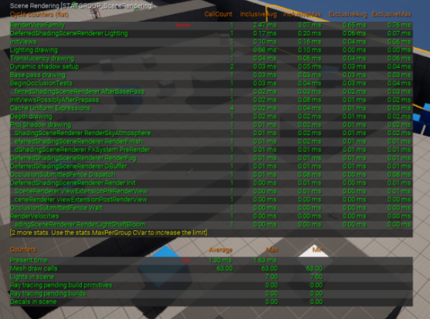

#老师推荐书籍

[RTR 4th（Real Time Rendering 4th）](https://github.com/Morakito/Real-Time-Rendering-4th-CN)

# 图形管线

1. 什么是渲染？
   - `Model`->`Texture`->`Light`->`Shader`->`Picture`
2. GPU怎么进行渲染？
   1. GPU管线（光栅化）：将场景经过一系列变换后绘制在屏幕上形成画面
   2. 光线追踪管线：模拟一束光从摄像机处打向屏幕，将光在穿过场景时的颜色变化绘制在屏幕上形成画面
3. GPU管线怎么工作的（下面的内容受限于表达能力和表达方式的不足大部分写的不够详细，详细的可以参考这篇文章[GPU渲染流水线简介](https://zhuanlan.zhihu.com/p/61949898)）
   1. `Draw Command`(CPU)
      - 准备并绑定资产
      - 切换状态开关
      - 传达绘制/计算指令
   2. `Geometry Process`(GPU)
      1. `Vertex Shader`：进行MV（Model、View）变换，将模型所处的坐标空间转换为视图坐标(view space)$$M_{view}=T_{view}R_{view}S_{view}M_{model}$$
         - $T_{view}=\begin{bmatrix}1 & 0 & 0 & x \\ 0 & 1 & 0 & y \\ 0 & 0 & 1 & z \\ 0 & 0 & 0 & 1\end{bmatrix}$，表示平移变换矩阵
         - $R_{view}=\begin{bmatrix}1 & 0 & 0 & 0 \\ 0 & \cos\alpha & -\sin\alpha & 0 \\ 0 & \sin\alpha & \cos\alpha & 0 \\ 0 & 0 & 0 & 1\end{bmatrix} \begin{bmatrix}\cos\beta & 0 & \sin\beta & 0 \\ 0 & 1 & 0 & 0 \\ -\sin\beta & 0 & \cos\beta & 0 \\ 0 & 0 & 0 & 1\end{bmatrix} \begin{bmatrix}\cos\gamma & -\sin\gamma & 0 & 0 \\ \sin\gamma & \cos\gamma & 0 & 0 \\ 0 & 0 & 1 & 0 \\ 0 & 0 & 0 & 1\end{bmatrix}$，表示旋转变换矩阵，其中$\alpha$、$\beta$、$\gamma$ 分别表示在$x$、$y$、$z$轴上的旋转角
         - $T_{view}=\begin{bmatrix}x & 0 & 0 & 0 \\ 0 & y & 0 & 0 \\ 0 & 0 & z & 0 \\ 0 & 0 & 0 & 1\end{bmatrix}$，表示缩放变换矩阵
      2. `Tessellation`（可选）：细分着色器，进行曲面细分
      3. `Geometry Shader`（可选）：几何着色器
         - 将顶点变换为完全不同的图元
         - 生成和删除顶点
      4. `Projection`：投影变换，分为正交投影和透视投影
         - 正交投影的变换矩阵为$$M_{ortho}=\begin{bmatrix}\frac{2}{r-l}&0&0&0\\0&\frac{2}{t-b}&0&0\\0&0&\frac{2}{n-f}&0\\0&0&0&1\end{bmatrix}\begin{bmatrix}0&0&0&-\frac{r+l}{2}\\0&0&0&-\frac{t+b}{2}\\0&0&0&-\frac{n+f}{2}\\0&0&0&1\end{bmatrix}$$
         - 透视投影的变换矩阵为$$M_{persp}=M_{ortho}\times M_{persp->ortho}=M_{ortho}\times\begin{bmatrix}n&0&0&0\\0&n&0&0\\0&0&n+f&-nf\\0&0&1&0\end{bmatrix}$$
         - 投影变换位于细分和几何着色器之后是因为投影变换不是非线性变换，在此之前应该完成所有的线性变换
         - 注：这里的变换矩阵并不是课上所给出的变换矩阵，而是[Games101](https://www.bilibili.com/video/BV1X7411F744/)课程中所给出的变换矩阵，推导过程也可参考Games101的Lecture 04上的推导过程
      5. `Clipping`：剪裁，将处于标准正方形边界上的图形进行剪裁，在边界上新增顶点，以保证标准正方形内部的图形均是由完整点和边所围成的；在标准正方形之外的图形就直接去除
      6. `Screen Mapping`：将处理好的标准正方形显示在屏幕上
   3. `Rasterization`(GPU)：光栅化，将需要渲染的三角形所包围的像素点进行标记并显示，这也会导致锯齿化的问题（**推荐去观看[Games101](https://www.bilibili.com/video/BV1X7411F744/)的Lecture 05，详细介绍了光栅化**）
   4. `Pixel Processing`(GPU)：为每个Pixel填充上正确的颜色，然后通过一系列处理计算，得到相应的图像信息，最终输出到显示器上

   

# GPU硬件（以Nvidia Fermi为主）

1. 建议直接去看[Nvidia架构演进——Fermi架构](https://zhuanlan.zhihu.com/p/632718322)、[官方白皮书](https://www.nvidia.com/content/pdf/fermi_white_papers/nvidia_fermi_compute_architecture_whitepaper.pdf)
2. 架构：
   1. GPC（Graphics Processing Cluster）
      1. SM（Streaming Multiprocessor）
         - Core：用于整数和浮点数的计算
         - LD/ST（Load/Store）：加载存储计算数据
         - SFU：执行数学函数计算
         - Register File（32768 * 32-bit）：32KB的32位寄存器
         - 64KB可配置的共享内存和L1缓存
         - 通用缓存
         - 纹理缓存
         - 双warp调度器
      2. Raster Engine
3. 移动端硬件特殊性（参考文章：[移动设备渲染架构](https://zhuanlan.zhihu.com/p/265151933)）
   1. Tile Based Rendering（TBR在硬件层面上实现）：
      - 减少对内存的访问带宽，将屏幕切块\[tile]，每个tile先完整染到TileBuffer（L2 Cache）上，再整体传回主存
      - 一个Render pass的所有draw call的Geometry process完全结束后，tiling处理器进行切块，再对每一块执行pixel shader process（Binning pass\[Tiling]）
   2. Dual-Pass Vertex Shading
      - 应用两次Vertex Shader，尽量减少不可见vertex的计算
      - 第一遍先使用position only的shader计算position，做clipping和culling
      - 第二遍再做做完整的shader\[Varying Shading]

      

# 模型和纹理

1. 模型：
   1. 顶点按照一定顺序排列（索引组织）起来组成若干平面（目前主要使用三角形）
   2. 附带的其他信息：
      - 法/切向量
      - 顶点色：
      - UV贴图：指模型经过UV展开后的贴图
2. 纹理：
   1. 生效过程：
      1. 将摄像机看见的区域由建模的空间坐标经过`projector function`转换为uv坐标
      2. 将uv坐标经过`corresponder function`转换为纹理坐标
      3. 将纹理坐标经过`obtain value`转换为纹理信息
      4. 最后把纹理信息通过`value transform function`转换为变换后的纹理信息
3. 模型和纹理的连接方式：
   1. 纹理放大和缩小：[纹理那些事儿](https://zhuanlan.zhihu.com/p/148732176)；
   2. 纹理缩小的[Summed Area Table](https://zhuanlan.zhihu.com/p/681670158)
   3. [LOD（level of Details）](https://zhuanlan.zhihu.com/p/384774807)：多层次细节，根据模型和摄像机距离的远近绘制更少或更多的细节
   4. [SDF](https://zhuanlan.zhihu.com/p/536530019)
   5. [UE5 Nanite](https://zhuanlan.zhihu.com/p/393930818)：
      - 采用虚拟化几何体表示场景中的三角形
      - 将几何体划分为 Cluster ，再使用group、VBH统一处理
      - 次线性缩放（Sub-linear scaling）
      - 软光栅小三角形（VisBuffer）
      - 学习资料：[Nanite技术简介bilibili](https://www.bilibili.com/video/BV1MP4y1a7Hh)、[Nanite探讨bilibili](https://www.bilibili.com/video/BV1Vy4y1g7zH)

      

# 光照和阴影

1. 光照
   1. 光照类型：
      - 方向光（平行光）
      - 点光源
      - 聚光灯
   2. [Blinn-Phone光照模型](https://zhuanlan.zhihu.com/p/442023993)
   3. [PBR（Physicallly-Based-Rendering）](https://zhuanlan.zhihu.com/p/33464301)
2. 阴影
   1. [Shadow Map](https://blog.csdn.net/ronintao/article/details/51649664)
   2. [CSM（Cascaded Shadow Map）](https://zhuanlan.zhihu.com/p/144025113)
3. [全局光照（GI）](https://zhuanlan.zhihu.com/p/550938337)
   - [虚幻引擎5渲染特性解析 Lumen](https://www.bilibili.com/video/BV1fu411272a)

   

# 后处理

1. [泛光bloom](https://zhuanlan.zhihu.com/p/525500877)
2. [色调映射Tone Mapping](https://zhuanlan.zhihu.com/p/21983679)
3. [伽马矫正Gamma Correction](https://baike.baidu.com/item/%E4%BC%BD%E7%8E%9B%E6%A0%A1%E6%AD%A3/7257507)
4. 在UE中自定义Post Process Material：
   1. 设置材质域：Post Process
   2. 使用`SceneTexture`节点及`PostProcessInput`节点
   3. 设置生效阶段
   4. 为 PostProcess Volume 添加自定义材质

   

# 渲染调试方法

1. 可视化
   
2. 统计命令（按`~`打开控制台并输入以下指令）
   1. `stat unit`
      
   2. `stat rhi`：各线程耗时
      
   3. `stat SceneRendering`
      
3. RenderDoc插件