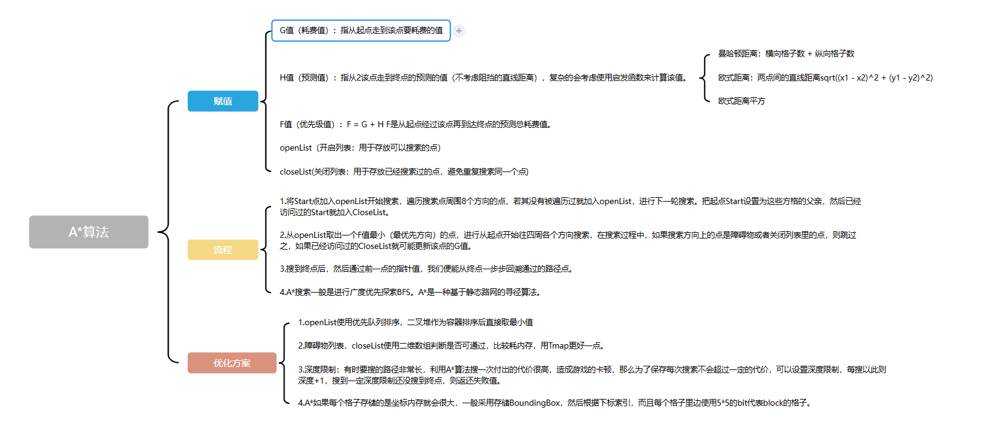

# 游戏基础技术介绍

## 游戏引擎的选择

游戏引擎不是汽车引擎只是给汽车提供动力，而是像一个汽车工厂可以给你提供各种零件和机床让你设计自己的汽车

## 游戏技术的分类（实现一个游戏角色AI需要哪些技术）：

1. 动画引擎
2. 物理引擎
3. 渲染引擎
4. 环境感知&行为模型&寻路系统
5. GamePlay&系统交互

## 动画系统：

1. 动画：游戏AI角色的表现载体，让角色看起来更真实
2. 动画种类
   - 帧动画
   - 程序动画
   - Morph动画
   - Curve动画
   - VertexShader动画
   - 骨骼动画（ [骨骼动画专栏](https://zhuanlan.zhihu.com/p/462945444)）

     

## 物理引擎

1. 物理：提供真实世界的感知反馈，为游戏角色AI角色增强效果，让AI有更丰富的感知和交互表现
2. 物理引擎的功能
   - 场景查询
   - AI感知
   - 碰撞检测
   - 事件触发
   - 物理约束模拟
3. [物理引擎专栏](https://zhuanlan.zhihu.com/p/660201778)

## 渲染引擎

## 交互系统

​	好的交互系统让游戏更易玩，战斗更爽快！开放题：你认为什么是好的交互？（简洁or复杂）

## 玩法系统

​	玩法GamePlay:"Gameplay"是一个非常广泛的概念，它涉及到游戏设计的所有方面，包括战斗，3C，AI，玩家能力等多个模块

- 说出你了解的游戏中的一个系统，拆解它包含哪些技术？举例：一个游戏的战斗系统应该如何拆解？包括哪些基础技术。

# 游戏AI技术介绍

## 游戏AI的目的

1. 提升玩家的游戏代入感以及各种情感
2. 有趣，强度适中，满足玩家心流的挑战
3. 行为合理，没有明显破绽
4. 可能需要“真实”

## 游戏AI四大主题

- 环境感知（Perception）
  1. 视觉（通过物理的SceneQuery）
  2. 听觉（NavMesh或其他数据）
  3. 将复杂环境数据转化为便于AI理解的简单中间数据
- 知识管理（记忆）（Knowledge Management）
  1. 通过[黑板（Blackboard）](https://www.cnblogs.com/KillerAery/p/10054558.html)来作为数据共享库
  2. 感应结果
  3. 寻路结果
  4. 分帧Plan的部分Plan结果
- 行为模型（决策）（Behavior Modeling）
  1. 通过感知和记忆，利用一些逻辑来辅助决策
  2. 不同的AI需求都有不同的最佳应用方案，没有万金油选手
  3. 了解不同方案的核心思路有助于选型、组合解决实际AI问题
  4. 各种AI行为模型
     1. **早期朴素脚本代码**：通过脚本组合一些行为逻辑，告诉AI下一步应该做什么
     2. [**有限状态机（FSM，Finite State Machine）**](https://blog.csdn.net/liqiangeastsun/article/details/118932263)：是一种相对简单的计算模型，由有限个状态（State）和状态之间的转换（Transition）组成
     3. [**分层有限状态机**](https://zhuanlan.zhihu.com/p/558422986)：在有限状态机的基础上增加了层次结构，它将状态机的状态进行分组，形成不同的层次
     4. [**行为树（Behavior Tree）**](https://blog.csdn.net/JeSuisDavid/article/details/139619212)：用于描述人工智能行为逻辑的树状结构模型，它通过各种类型的节点来构成复杂的行为序列，以控制智能体的行为
        - 结构组成：
          - 根节点（Root Node）：行为树的起始点，所有的行为逻辑都是从根节点开始向下执行的。在一个游戏角色的行为树中，根节点可能代表“角色的整体行为控制”
          - 控制节点（Control Node）：
            - 顺序节点（Sequence Node）
            - 选择节点（Selector Node）
            - 并行节点（Parallel Node）
          - 行为节点（Action Node）：这些节点代表具体的行为动作，比如“移动到指定位置”、“播放动画”、“发出声音”等。行为节点是行为树中实际执行具体操作的部分
- [寻路专栏](https://zhuanlan.zhihu.com/p/656641483)
  1. 深度优先搜索（dfs）

  2. 广度优先搜索（bfs）

  3. A\*算法

     

  4. NavMesh
- 番外
  1. 深度学习（[《动手学深度学习》](https://zh.d2l.ai/)）：
     - 线性神经网络
     - 多层感知机MLP
     - 卷积神经网络CNN
     - 深度卷积神经网络AlexNet
     - 循环神经网络RNN
     - 注意力机制&Transformer
  2. 神经网络
  3. 强化学习：马尔可夫决策过程
     1. 五要素：
        - Agent：智能体
        - Environment：环境
        - State：状态
        - Action：行动
        - Reward：奖励
     2. 训练赛车游戏：AI赛车随机进行方向变换，赛车不断向前走，一旦跑到赛道外就reward-100，一直前进每秒reward+1，到达终点reward+1000（这样的奖励机制可能有问题，如果赛车在赛道上一直转圈圈那么分就会无限累加）。AI会不断根据reward反馈最高的操作记录下来训练，下次遇到相同的路就采用相同的操作模式

     

# 游戏AI在Unreal5基础实现

##行为树

1. 创建敌人控制器
   - 创建一个新的蓝图，其继承自AIController，命名为`EnemyController`
2. 关联敌兵控制器
   - 将`EnemyCharacter`的`AI Controller Class`设为`EnemyController`
3. 创建敌人AI控制器的大脑：行为树
   - 创建敌人的行为树，命名为`BT_Enemy`
   - 在敌人AI控制器的蓝图脚本`Begin Play`时，执行`Run Behavior Tree`节点，并选择为`BT_Enemy`
4. 运行行为树
   - 为`BT_Enemy`添加`Sequence`节点以及数个`Wait`节点，并运行
   - 最简单（也是最无聊）的AI已经完成了
5. 增加巡逻功能
   - 创建`NavMesh`
     1. 将`NavMeshBoundsVolume`拖到场景，调整`Scale`以套住关卡
     2. 一般会自动构建`NavMesh`，也可使用`Build`手动创建
     3. 在关卡视口里按`P`键可显示隐藏`NavMesh`
     4. 更多设置也可在`RecastNavMesh Actor`中设置
   - 创建敌人AI大脑的记忆：黑板
     1. 在`BT_Enemy`中新建黑板
     2. 在黑板中增加字段，设置`Key`为`PatrolLocation`，类型是`Vector`表示位置向量
     3. 在行为树中增加`Move To`节点，并且目标点通过`Key`来引用刚创建好的黑板变量
   - 行为树`TASK`：修改黑板字段为随机位置
     1. 新建继承自`UBTTask_BlueprintBase`的蓝图类，命名为`BP_BTTask_GetRandomLocation`
     2. 增加逻辑，当开始执行AI时，在Actor附近10米用`NavMesh`搜索可达的随机位置，并且设置到黑板变量中，并返回Task的执行结果
     3. 在黑板中通过新建引用变量传入
     4. 在行为树上使用Task，并且为其参数`Blackboard Key`填入我们需要的`PatrolLocation`

     

## AI Perception

1. 增加AI视觉感知
   - 在敌人控制器增加`AIPerception`组件、增加配置`AI Sight Config`，并设置为检测所有势力
2. 为玩家角色增加视觉触发器
   - 在玩家角色`BP_ThirdPersonCharacter`增加`AIPerceptionStimuliSource`组件、增加配置`AISense_Sight`
3. 在黑板增加用于视觉记忆的字段：目标Actor
   - 重载`OnPerceptionUpdate`事件，并在其中添加逻辑

   

## Environment Query System（EQS）

1. 新建EQS，并且设置锥形查询
2. 用EQS查询代替随机移动TASK
   - 给AI一个随机位置
   - EQS可以帮助AI选择一个更好（经过规则筛选以后）的位置

   

# 最后的结构问题

1. 不要为了实现一个玩法而不计代价
2. 不要粗暴得只管实现，不管制作流程和技术架构