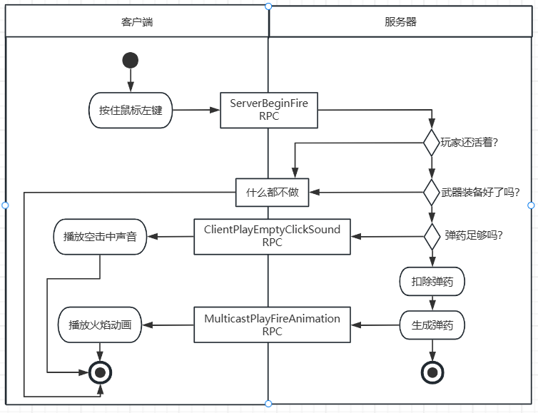
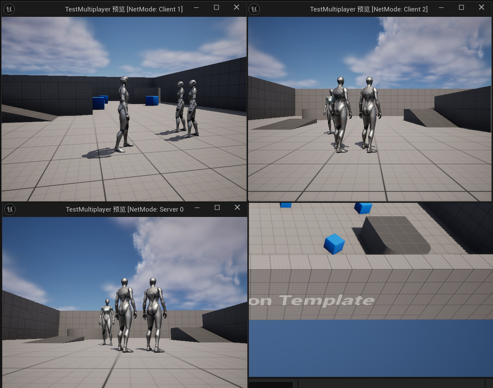

[Unreal官方多人游戏编程快速入门指南（使用C++）](https://dev.epicgames.com/documentation/zh-cn/unreal-engine/multiplayer-programming-quick-start-for-unreal-engine)

# 计算机网络基础

## 计算机网络体系结构（分层结构），分层结构的优势：

- 功能独立、维护便利
- 简化设计
- 层内部的设计标准化
- 灵活、可扩展
- 故障隔离，便于定位问题所在


## Socket

- 概念：Socket是应用层和传输层之间的一个抽象层，它把TCP/IP层复杂的操作抽象为几个简单的接口供应用层调用以实现进程在网络中通信；


- 通信流程：Socket是”打开——读/写——关闭“模式的实现，UDP模式服务端没有Listen、Accept，客户端没有Connect流程；

​                                                                           **玩家开火时客户端与服务器交互**




## TCP

​                                                      **TCP/UDP协议对比**

| 对比域           | TCP                                          | UDP              |
| ---------------- | -------------------------------------------- | ---------------- |
| 数据传输前的准备 | 需要建立连接                                 | 无需建立连接     |
| 数据传输是否可靠 | 可靠。提供超时重发、校验数据、流量控制等功能 | 不可靠           |
| 资源占用         | 占用高，协议设计比较复制，存在一定延迟       | 占用少，传输快。 |


## P2P、C/S架构

1. P2P（Peer to Peer)：也称点对点，是无中心服务器、依靠用户群交换信息的互联网体系。网络中的每个用户端既是一个节点，也具有服务器功能
2. C/S（Client/Server）架构：也称主从式架构，架构分为服务端和客户端，所有客户端只和服务端对连，客户端之间的通信必须通过服务器，软件开发简单，可控性好。服务器压力较大。


# 数据同步基础

## RPC（Remote Process Call）

- 概念：RPC，即远程过程调用。本地调用远端提供的函数/方法，因为不是同一个内存空间，不能直接调用，需要通过网络来表达调用的语义和传达调用的数据
- 实现：
  - 需要解决的问题：在远程调用时，我们需要执行的函数体是在远程的机器上的，也就是执行是在另一个进程中。另一端是不知道函数指针和堆栈数据的
  - Call ID映射：通过Call ID识别所要调用的函数
  - 序列化与反序列化：压缩、加密调用函数时的一些参数数据，提高传输效率
  - 网络传输：


## 对象序列化：

- 类似于函数ID映射，本地用到的对象想要在另一端也能够直接使用，这样会大大简化上层业务逻辑开发，这就需要对象序列化。
- 对象序列化是将对象转换成一系列字节，这样对象就可以很容易地保存到持久存储中，或者通过通信链路传输。然后可以将字节流反序列化——转换为原始对象的副本
- 属性同步：属性同步是对象序列化后产生的性质，属性同步一般是服务器更改，同步到其他所有客户端，主要是为了解决数据冲突和安全性考虑


## 帧同步与状态同步

- 帧同步：帧同步技术是早期RTS游戏常用的一种同步技术。与状态同步不同的是，帧同步**只同步操作**，其大部分游戏逻辑都在客户端上实现，服务器主要负责广播和验证操作，**有着逻辑直观易实现、数据量少、可重播，一致性好等优点**。
- 状态同步：
  - **同步的是游戏中的各种状态**。一般的流程是客户端上传操作到服务器，服务器收到后计算游戏行为的结果，然后以广播的方式下发游戏中各种状态，客户端收到状态后再根据状态显示内容。
  - 状态同步其实是一种不严谨的同步。它的思想中，不同玩家屏幕上的表现的一致性并不是重要指标，只要每次操作的结果相同即可。所以状态同步**对网络延迟的要求并不高，甚至充许一段时间的不一致**。

  ​                                                  **状态同步/帧同步对比**

|                    | 状态同步                                         | 帧同步                           |
| ------------------ | ------------------------------------------------ | -------------------------------- |
| 客户端一致性       | 最终一致，中间可能有拉扯                         | 一直保持一致                     |
| 网络延迟要求       | 低                                               | 高                               |
| 网络流量           | 与物体数量成正比                                 | 与操作数量成正比                 |
| 服务器任务         | 接受输入、全局仿真、状态复制                     | 同步操作                         |
| 客户端任务         | 局部世界的展示                                   | 全局仿真                         |
| 玩家短线或中途加入 | 容易                                             | 困难，如需从第一帧重新运算       |
| 开发效率           | 低、前后端联合开发                               | 高，接近与单机游戏               |
| 安全性             | 服务器逻辑安全性高，部分功能在客户端实现容易作弊 | 安全性低，但因决定性可做事后验证 |

- 网络延迟高或者抖动，会影响游戏体验，常见的表现有**拉扯**、**瞬移**、**攻击敌方没有伤害**等，对抗延迟的方法有：
  - 服务器延迟补偿
  - 客户端平滑算法：
    - 插值
    - 预测
    - 缓存


# UE网络同步的使用

## UE网络同步模型

1. 以“客户端-服务器”模型为基础
2. 实现面向对象式封装
3. 实现网络代码和游戏逻辑完全分离
4. 网络同步支持可视化编程
5. 网络协议使用UDP通讯


## UE网络模型

1. Standalone：此类型说明服务器在本地计算机上运行且不接受来自远程计算机的客户端，适合单人游戏或本地多人游戏
2. DedicatedServer：专用服务器，不承担玩家的功能。可以通过丢弃声音、图形、用户输入和其他面向玩家的功能来更高效地运行。此类型服务器用于托管在受信任服务器上的多人游戏
3. ListenServer：监听服务器是一个既承担本地玩家功能，同时也对来自远程玩家的连接开放的服务器。此类型服务器适用于不需要专属服务器，且用户可以在没有第三方服务器的情况下设置和游玩竞争或合作类游戏。
4. Client：这是唯一的非服务器模式。在此模式下，本地计算机是专属或监听服务器的客户端，因此不会运行服务器端逻辑


## 客户端与服务端连接流程

1. Client：`UPendingNetGame::SendInvitation 发送加入请求`
2. Server：`UWorld::NotifyControlMessage 检验客户端版本是否一致`
3. Client：`UPendingNetGame::NotifyControlMessage 发送登录请求`
4. Server：`UWorld::NotifyControlMessage->AGameModeBase::PreLogin 校验逻辑`
5. Server：`UWorld::WelcomePlayer->AGameModeBase::GameWelcomePlayer 同意登录请求`
6. Client：`LoadMap`
7. Server：`AGameModeBase::Login 创建PlayerController`
8. Server：`AGameModeBase::PostLogin 登录成功，进入游戏逻辑`


## Actor的复制，提供的同步能力：

- Creation and Destruction 创建和销毁
- Movement 移动
- ==Properities 属性==
- Components 组件
- Subobjects 子对象
- ==Remote Procedures Calls（RPC）远程程序调用==

```c++
ADemoCharacter::ADemoCharacter()
{
  bReplicates = true;  //将bReplicates设为true以启用Actor的复制功能
  CharacterMovement->SetIsReplicated(true);  
  //使用函数SetIsReplicated(true)以启用组件的复制功能
}
```


## Role、属性同步、RPC等基础概念

1. Role权限（C/S架构）
   - `Role_None`
   - `Role_SimulatedProxy`：模拟权限，客户端所持有的权限
   - `Role_AutonomousProxy`：主控权限，服务端的玩家所持有的权限
   - `Role_Authority`：权威，服务端所具有的权限
2. 属性同步

```c++
//头文件中的定义
UPROPERTY(Replicated)  //添加Replicated参数以启用同步功能
float Health;
UPROPERTY(Replicated)
int Exp;
UPROPERTY(ReplicatedUsing = OnRep_Level)  //添加回调函数功能
int Level

UFUNCTION()
void OnRep_Level(int OldLevel);

//cpp文件中的实现
void ADemoCharacter::OnRep_Level(int OldLevel)
{
  //回调函数逻辑
}

void ADemoCharacter::GetLifetimeReplicatedProps(TArray<FLifetimeProperty>& OutLifetimeProps) const
{
	Super::GetLifetimeReplicatedProps(OutLifetimeProps);

	//所有需要复制的变量需要在这个函数中一一列举出来，并设置变量是否具有特殊的复制时机
	DOREPLIFETIME(ADemoCharacter, Health);
	DOREPLIFETIME_CONDITION(ADemoCharacter, Exp, COND_OwnerOnly);
	DOREPLIFETIME_CONDITION(ADemoCharacter, Health, COND_None);
}	
```

属性复制的规则：

1. 只支持从服务器复制到客户端，且都是Reliable的
2. 在每帧更新完所有Actor的属性状态会执行一遍所有Actor的属性复制
3. 只复制那些与上一顿对比发生过变化的属性（Lazy Replication）
4. 如果是第一次复制，则复制跟默认值对比不一致的属性
5. 只支持复制静态数组，并且只复制数组中与上一对比发生过变化的那一项
6. 支持复制结构体，结构体中任意属性与上一顿对比发生过变化，都会导致复制结构体的所有属性
7. 属性复制支持回调事件

Condition Property Replication（`DOREPLIFETIME_CONDITION`参数）

| 条件                      | 说明                                                         |
| ------------------------- | ------------------------------------------------------------ |
| `COND_InitialOnly`        | 该属性仅在初始数据组尝试发送                                 |
| `COND_OwnerOnly`          | 该属性仅发送至actor的所有者                                  |
| `COND_SkipOwner`          | 该属性将发送至除所有者之外的每个连接                         |
| `COND_SimulatedOnly`      | 该属性仅发送至模拟actor                                      |
| `COND_AutonomousOnly`     | 该属性仅发送给自治actor                                      |
| `COND_SimulatedOrPhysics` | 该属性将发送至模拟或`bRepPhysicsactor`                       |
| `COND_InitialOrOwner`     | 该属性将发送初始数据包，或者发送至actor所有者                |
| `COND_Custom`             | 该属性没有特定条件，但需要通过`SetCustomlsActiveOverride`得到开启/关闭能力 |

RPC函数

```c++
//头文件定义
UFUNCTION(Server, Reliable, WithValidation) //在服务端上运行、可靠函数、有条件的
void ServerDoSth();

UFUNCTION(Client, Unreliable)  //在客户端上运行、非可靠函数
void ClientDoSth();

UFUNCTION(NetMulticast, Unreliable)  //由服务器广播至每一个客户端执行、非可靠函数
void NetMulticastNotifySth();
//cpp文件实现
void ADemoCharacter::ServerDoSth_Implementation()
{
	//...
}
void ADemoCharacter::ServerDoSth_Validation()
{
	//...
}
void ADemoCharacter::ClientDoSth_Implementation()
{
	//...
}
void ADemoCharacter::NetMulticastNotifySth_Implementation()
{
	//...
}
// 1.支持服务器和客户端双向复制
// 2.可以被标记为：Client、Server、NetMulticast
// 3.可以是Reliable或者UnReliable的
// 4.函数复制没有返回值，也不支持输出型函数
// 5.必须在Actor上调用
```

​                                               **不同情况下服务器调用RPC的执行情况**

| Actor所有权        | 未复制         | NetMulticast               | Server         | Client                  |
| ------------------ | -------------- | -------------------------- | -------------- | ----------------------- |
| Client-owned Actor | 在服务器上运行 | 在服务器和所有客户端上运行 | 在服务器上运行 | 在Actor的所属客户上运行 |
| Server-owned Actor | 在服务器上运行 | 在服务器和所有客户端上运行 | 在服务器上运行 | 在服务器上运行          |
| Unowned Actor      | 在服务器上运行 | 在服务器和所有客户端上运行 | 在服务器上运行 | 在服务器上运行          |

​                                               **不同情况下客户端调用RPC的执行情况**

| Actor所有权                 | 未复制                   | NetMulticast             | Server         | Client                   |
| --------------------------- | ------------------------ | ------------------------ | -------------- | ------------------------ |
| Owned by Invoking           | 在执行调用的客户端上运行 | 在执行调用的客户端上运行 | 在服务器上运行 | 在执行调用的客户端上运行 |
| Owned by a different client | 在执行调用的客户端上运行 | 在执行调用的客户端上运行 | 丢弃           | 在执行调用的客户端上运行 |
| Server-owned Actor          | 在执行调用的客户端上运行 | 在执行调用的客户端上运行 | 丢弃           | 在执行调用的客户端上运行 |
| Unowned Actor               | 在执行调用的客户端上运行 | 在执行调用的客户端上运行 | 丢弃           | 在执行调用的客户端上运行 |


# **UE网络同步的实现**

## **Unreal为何使用UDP协议**

1. **TCP协议的可靠性无法定制**
   - **所有数据都是可靠的（游戏中很多数据是可以丢失的）**
   - **为了保证数据的时序性，牺牲了时效性（一旦出现丢包，会阻塞后面数据的发送）**
2. **TCP协议与UDP协议混合使用？**
   - **对于时序性要求很高的数据，通过TCP协议传输**
   - **对于时效性要求很高的数据，通过UDP协议传输**
   - **增加了设计的复杂度**
   - **TCP与UDP都是基于IP协议，它们在底层会互相干扰**
3. **纯UDP协议的好处**
   - **可自己定制丢包时的处理逻辑**
   - **可以同时兼顾时序性数据和时效性数据**

   

## **UE网络同步主要的类**

- **`NetDriver`——网络管理类**
  - **管理网络连接，驱动整个网络收发逻辑**
  - **创建和管理`NetConnection`**
  - **收发网络`Packet`**
  - **除了`GameNetDriver`，还有`DemoNetDriver`专门处理录像回放的逻辑**
- **`NetConnection`——抽象的网络连接**
- **`Packet`——数据包**
  - **客户端与服务器之间的连接**
  - **服务器会有多个`NetConnection`，每一个对应一个客户端连接**
  - **客户端会有一个`ServerConnection`**
  - **创建和管理`Channel`**
  - **每个通信包是一个`Packet`，每个`Packet`有一个唯一的Seq，Seq自增且不会重复利用**
  - **`Packet`网络不稳定可能出现丢包，丢包时`Connection`不会重发，但会通知`Channel`**
- **`Channel`——数据传输的管道**
  - **每个`NetConnection`管理着自己的Channel集合**
  - **`Channel`以`Bunch`为单位进行数据的接收和发送**
  - **发送时，`Channel`将`Bunch`数据交给`NetConnection`以`Packet`发送**
  - **接收时，`NetConnetion`将`Bunch`分发给对应的`Channel`进行处理。**
  - **Channel有4种类型：==`ActorChannel`==、`ControlChannel`、`FileChannel`、`VoiceChannel`**
- **`Bunch`——管道中传输的数据串**
  - **数据流通的基本单位**
  - **位流，充分利用了每一个Bit**
    - **对于`bool`型的数据，使用一个`Bit`来存储**
    - **对于其他类型的数据，会根据数据的范围选择最节省的若干个Bit来存储**
  - **`Reliable`&`UnReliable`**
    - **`ReliableBunch`，保证一定会发送到远端，并且按发送的顺序进行处理**
    - **`UnReliableBunch`，网络丢包有可能导致`Bunch`不能发送到远端**

    

## **`Channel`&`Bunch`一些问题**

1. **Q：`Channel`是如何打开的？**
2. **A：每个`Channel`所发送的第一个`Bunch`，`Bunch`头部会自动带上`Open`的标志位以及`Channel`的类型和序号，通知远端创建对应的`Channel`。**
3. **Q：`Channel`是如何处理`Packet`的确认信号的？**
4. **A：`Channel`发送`Bunch`的同时会将该`Bunch`复制一份缓存到输出链表，等远端确认收到该`Bunch`后才从缓存中清除**
5. **Q：`Channel`是如何处理`Packet`丢失的？**
6. **A：`Channel`缓存（最多128个）`ReliableBunch`，并对丢失的`Bunch`进行重发，确保`ReliableBunch`能发送到远端。**
7. **Q：`Channel`是如何保证按顺序处理`Bunch`的？**
8. **A：`ReliableBunch`是带序号的，`Channel`会缓存收到的不连续的`Bunch`，确保`Bunch`能按顺序处理**
9. **Q：`Channel`是如何关闭的？**
10. **A：当`Channel`关闭的时候，它会发送一个独立的空的`Bunch`，`Bunch`头部带上了`Close`的标志位，同时把本地的`Channel`标志为`Closing`状态，禁止接收或发送任何数据，等远端收到该`Bunch`并返回确认信号后，`Channel`才会真正地关闭。**


## **网络分析工具**

1. **Network Profiler**
   - **查看网络相关的属性**
   - **检索网络同步的属性和RPC**
   - **游戏运行时动态开关**
2. **Network Insights**
   - **Unreal Insights的一部分**
   - **可以实时监控**
   - **可以读取utrace文件**
   - **可以监控同步时的每个数据包**


# 多人游戏基础

​	在游戏开发者眼中，“多人游戏”是指一组通过网络（互联网或局域网）在服务器和连接的客户端之间发送指令，以制造一种共享世界的虚拟体验。

​	要实现这一点，服务器与客户端要能够相互通信。因为客户端通常是影响游戏世界的一方，所以它们需要一种方式在玩游戏时向服务器传达它们的意图。

（1）玩家通过按住鼠标左键向服务器发送武器发射请求。

（2）服务器通过以下检查来验证玩家是否可以开枪。

- 玩家是否还活着。
- 玩家是否已经装备了武器。
- 玩家是否有足够的弹药。

（3）如果所有条件都有效，服务器将执行以下操作。

- 运行逻辑来扣除弹药。
- 在服务器上生成抛射Actor，并自动发送到所有客户端。
- 在所有客户端的角色实例上播放火焰动画，以确保客户端之间的同步，这有助于传达同一个世界的概念，即使事实并非如此。

（4）如果任何一个条件未满足，服务器将向特定的客户端发送指示。

- 玩家已经死亡：什么都不做。
- 玩家没有装备武器：什么都不做。
- 玩家弹药不足：播放空的点击声音。


## 建议

​	如果想让游戏支持多人游戏，强烈建议在开发早期就实现这一功能。如果我们尝试在一个原本设计为单人游戏的项目中添加多人游戏功能，会发现有些功能可以正常运行，但大多数功能不能正常运行。

​	出现这种问题的原因是：以单人模式执行游戏时，代码会在本地立即运行，但是将多人游戏添加到游戏中时，要添加外部因素，例如权威服务器，该服务器在网络上与客户端通信并存在延迟。

​	为了使一切正常工作，我们需要将现有代码分解为以下组件。

- 只在服务器上运行的代码

- 只在客户端上运行的代码

- 在服务器和客户端上同时运行的代码

  为了向游戏中添加多人游戏功能，UE内置了强大且带宽高效的网络框架，该框架使用权威的服务器-客户端架构。每个玩家控制一个客户端，该客户端使用双向连接与服务器进行通信。服务器运行带有游戏模式（只存在于服务器中）的特定关卡，并控制信息流，以便客户端可以在游戏世界中看到并相互交互。


# 服务器

​	服务器是体系结构中最关键的部分，因为它负责处理大部分工作并做出重要决策。

- **创建和管理共享世界实例**

  ​	服务器在特定的关卡和游戏模式中运行其游戏实例，它将作为所有连接的客户端之间的共享世界。所使用的关卡可以在任何时间点更改，如果更改得适用，服务器可以自动连接所有已连接的客户端。

- **处理客户端加入和离开请求**

  ​	如果客户端想要连接到服务器，它需要请求权限。为此，客户端通过直接IP连接或在线子系统（如Steam）向服务器发送连接请求。一旦连接请求到达服务器，它将执行一些验证来确定请求是被接受还是被拒绝。

  ​	**服务器拒绝请求的常见原因：**服务器的容量已经满了，不能再接受任何客户端，或者客户端使用的是过时版本的游戏。如果服务器接受请求，则将具有连接的玩家控制器分配给客户端，并调用游戏模式中的`PostLogin函数 `。从那时起，客户端将进入游戏，成为共享世界的一部分，玩家将能够看到其他客户端并与之互动。如果一个客户端在任何时间点断开连接，那么将通知所有其他客户端，并调用游戏模式中的`Logout函数`。

- **生成所有客户端都需要知道的Actor**

  ​	如果我们希望生成一个存在与所有客户端的Actor，那么需要在服务器上执行此操作。原因是服务器具有权限，并且是唯一可以告诉每个客户端创建该Actor的实例的服务器。

  ​	这是多人游戏中最常见的生成Actor的方式，因为大多数Actor需要存在于所有客户端中。这方面的例子：能量升级，这是所有客户端都可以看到并与之交互的东西。

- **运行关键的游戏逻辑**

  ​	为了确保游戏对所有客户端都是公平的，关键的游戏逻辑只需要在服务器上执行。如果客户端负责处理扣除生命值，这将是非常容易被利用的，因为玩家可以使用工具将当前的生命值更改为内存中的100%，这样玩家永远不会在游戏中死亡。

- **处理变量复制**

  ​	如果有一个复制的变量，那么它的值应该只在服务器上更改，这将确保所有客户端都将自动更新该值。仍然可以在客户端上更改该值，但它将始终被替换为服务器的最新值，以防止作弊并确保所有客户端同步。

- **处理来自客户端的RPC**


## 专用的服务器

​	专用服务器只运行服务器逻辑，因此我们不会看到典型的游戏运行窗口，但可以像普通玩家一样控制角色。这意味着所有客户端都将连接到这个服务器，服务器唯一的工作就是协调客户端并执行关键的游戏逻辑。此外，如果使用`-log`命令提示符运行专用服务器，我们将拥有一个控制台窗口，该窗口记录有关服务器上正在发生的事情的相关信息，例如客户端是否已连接或已断开等。作为开发人员，我们还可以使用UE_LOG宏记录信息。

​	使用专用服务器是为多人游戏创建服务器的一种非常常见的方法，由于它比监听服务器更轻量级，因此可以将其托管在服务器堆栈上并让其运行。专用服务器的另一个优点是，它将使游戏对所有玩家更公平。因为网络条件对每个人都是一样的，也没有客户端有权限，所以也降低了被黑客攻击的可能性。


## 监听服务器

​	监听服务器同时充当服务器和客户端，因此还将有一个窗口，可以在其中使用此服务器类型作为客户端玩游戏。它的另一个优点是在打包构建中运行服务器的最快方法，但它不像专用服务器那样轻量级，因此可以同时来连接的客户端数量将受到限制。


# 客户端

​	客户端是体系结构中最简单的部分，因为大部分Actor都在服务器上拥有权限，所以在这种情况下，工作将在服务器上完成，而客户端只需服从其命令。

- **强制从服务器复制变量：**

  ​	服务器通常对客户端知道的所有Actor都具有权限，因此当在服务器上更改复制变量的值时，客户端也需要强制执行该值。

- **处理来自服务器的RPC：**

- **模拟时预测运动：**

  ​	当客户端模拟Actor时，它需要根据Actor的速度本地预测其将位于何处。

- **生成仅有客户端需要知道的Actor：**

  ​	如果我们想生成仅存在于客户端上Actor，那么需要在该特定的客户端上执行此操作。



​                            **使用监听服务器运行启动三个客户端窗口（Server 0为监听服务器窗口中的角色）**